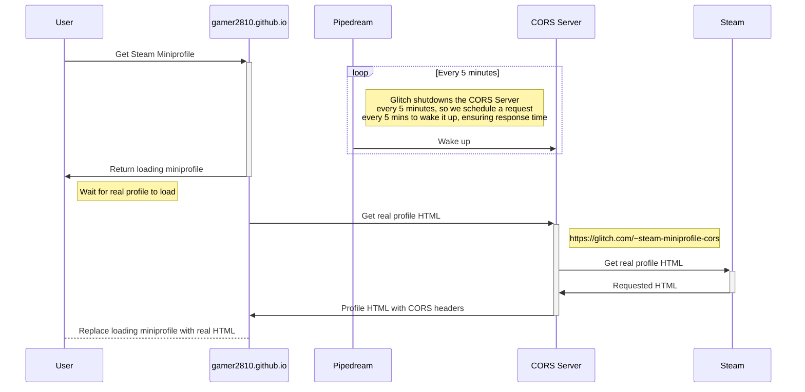

## Introduction

Steam MiniProfile is a sleek, embeddable widget that fetches and displays your Steam profile information in real-time. With just a few lines of code, you can showcase your Steam avatar, username, current online status, recent games, and more—right on your website!

This widget is perfect for gaming communities, streamers, or anyone who wants to add a personal touch to their website by integrating their Steam presence seamlessly.

## Features at a Glance

* 🎮 **Real-Time Steam Data** – The widget fetches your profile info directly from Steam, ensuring it's always up to date.
* ✨ **Customizable UI** – Adjust colors, layout, and design elements to match your website's aesthetic.
* ⚡ **Lightweight & Fast** – Built for performance, the widget is optimized to load quickly without affecting page speed.
* 🔧 **Easy Integration** – Just drop the widget on your website and configure it with your Steam ID.
* 🔍 **Supports Public Profiles** – Works with any Steam account that has a public profile.

## How It Works

## Get Started

Ready? Head over to the GitHub repository to grab the code and set it up in minutes:

➡️ **[GitHub Repo: gamer2810/steam-miniprofile](https://github.com/gamer2810/steam-miniprofile)**

Join the growing community of gamers showcasing their Steam profiles effortlessly. If you have any feature requests or encounter any issues, feel free to open an issue on GitHub!

Happy gaming! 🎮
