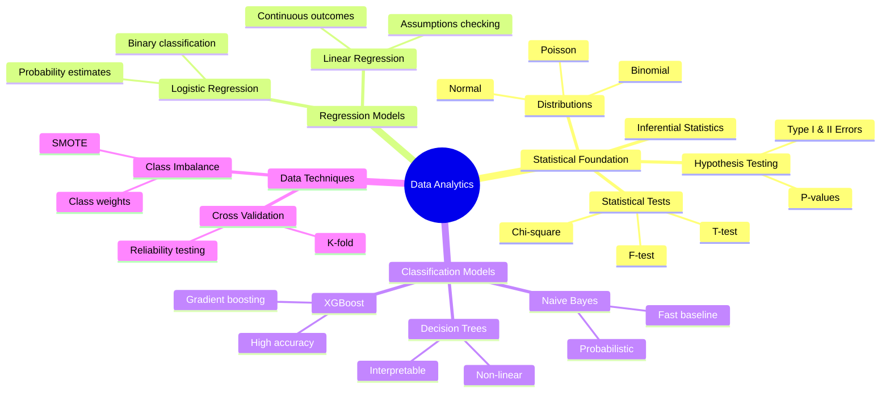
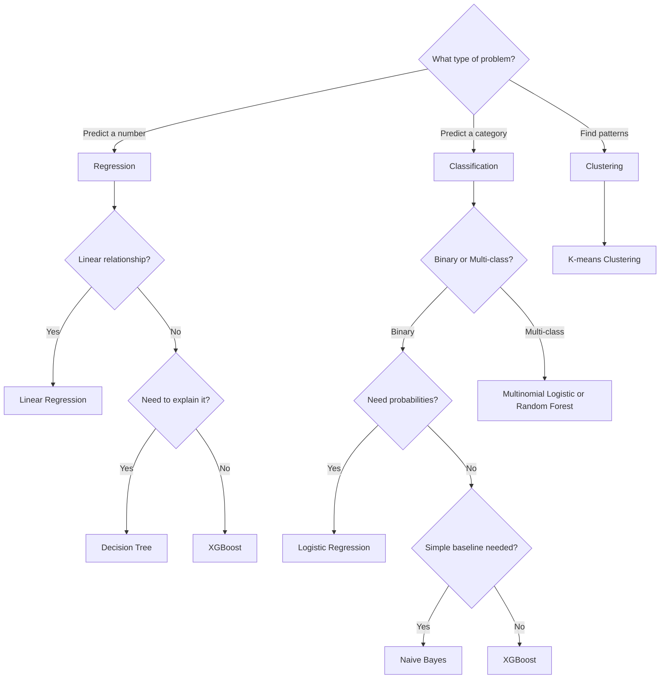

## The Biggest Shift: Understanding When to Use Which Model

The most significant thing I learned wasn't mastering a specific algorithm or statistical test. It was developing a framework for model selection.

Before this program, I approached modeling somewhat randomly. I knew linear regression for continuous outcomes, logistic regression for classification, decision trees when I wanted something interpretable. But I didn't have a systematic way to choose. I'd try different models and pick what scored highest.

What changed was understanding the underlying principles behind model selection:

The **target variable type** dictates the model family: regression for continuous, classification for categorical. The **relationship structure** between features and target (linear versus non-linear) determines model complexity. The **data characteristics** (size, balance, feature interactions) reveal which models will actually work well. And the **business context** (interpretability versus pure accuracy) guides the final choice.

This transformed model selection from trial-and-error into a systematic decision process. I can now articulate why a particular model makes sense for a given problem, not just that it happened to score well.

## The Conceptual Landscape

Here's how all the concepts I learned connect together:

## Decision Tree: Choosing the Right Model

One of the most practical tools I developed was this decision framework:

## What Actually Stuck

Let me walk you through the concepts that actually changed how I think, not just what I memorized for a quiz.

### Inferential Statistics: Understanding Uncertainty

Inferential statistics is about using sample data to make conclusions about entire populations. But more importantly, it's a framework for being honest about uncertainty.

Every prediction carries uncertainty. Every confidence interval has assumptions. The sampling distribution (the distribution of sample statistics across repeated samples) is what allows us to quantify that uncertainty and make probabilistic statements about population parameters.

This changed how I think about communicating results. Instead of stating findings as absolute facts, I now think in terms of confidence levels, margins of error, and the assumptions underlying those statements.

### Hypothesis Testing: Beyond the P-Value

Hypothesis testing provides a structured framework for testing claims with data. The key insight I gained was understanding what a p-value actually represents: the probability of observing data this extreme (or more extreme) if the null hypothesis were true.

This is subtle but critical. A p-value isn't the probability that the null hypothesis is true, or the probability of making a mistake. It's about how unusual your observed data would be under the null hypothesis.

The tradeoff between Type I error (false positive) and Type II error (false negative) is fundamental; you can't minimize both simultaneously. The choice depends on context: what's worse in this specific situation, a false alarm or a missed detection?

### The Statistical Test Maze (Or: How I Learned to Stop Worrying and Check My Data Types)

This was brutal. I'd look at a problem and panic: Chi-square? F-test? T-test? ANOVA? Pearson correlation? The sheer number of options paralyzed me.

The trick that finally worked: match the test to your data types and question structure.

**Chi-square** is for categorical data. "Is purchase behavior independent of marketing channel?" Both variables are categories, so chi-square.

**T-test** compares means between two groups. "Do conversion rates differ between landing page A and B?" Two groups, continuous outcome, t-test.

**ANOVA** is like a t-test for three or more groups. "Do sales differ across our five regions?" More than two groups, continuous outcome, ANOVA. (Which uses the F-statistic to compare between-group variance to within-group variance.)

**F-test** on its own is for comparing variances. "Is customer spending more variable in region A than region B?"

I still reference a decision tree for this. The knowledge isn't fully internalized yet. But I'm no longer panicking; I'm methodically checking data types and question structure.

### Distributions: Why Shape Matters

Understanding distributions changed how I look at data. It's not just about calculating means and standard deviations; it's about recognizing the underlying process generating the data.

The **normal distribution** shows up everywhere because of the Central Limit Theorem: average enough independent random things and you get a bell curve, regardless of the underlying distribution. That's why we can use normal-based inference on sampling distributions even when raw data isn't normal.

The **binomial distribution** is for counting successes in repeated yes/no trials. Click-through rates, conversion events, success/failure. If I flip a coin 100 times, binomial tells me the probability of getting exactly 60 heads.

The **Poisson distribution** models count data for rare events: customer service calls per hour, defects per batch, earthquakes per year. It's defined by a single parameter (λ, the average rate) and useful when events happen independently at a constant average rate.

Why does distribution choice matter? Because the statistical tests we use assume specific distributions. Run a t-test on heavily skewed data and your p-values are wrong. Use linear regression when errors aren't normally distributed and your confidence intervals don't mean what you think they mean.

I learned to actually check my assumptions, not just assume them away.

### Regression Models

**Linear regression** models the relationship between predictors and a continuous outcome:

$$y = \beta_0 + \beta_1 x_1 + \beta_2 x_2 + ... + \epsilon$$

The coefficients ($\beta$) tell you how much y changes for a one-unit increase in x, holding everything else constant. That "holding constant" qualifier is crucial for interpretation.

What I learned is that linear regression comes with assumptions that need checking: linearity of relationships, independence of observations, constant variance of residuals (homoscedasticity), and normality of errors. These aren't just formalities. Violating them means your coefficients and confidence intervals don't mean what you think they mean.

**Logistic regression** extends this to classification by modeling probabilities:

$$P(y=1) = \frac{1}{1 + e^{-(\beta_0 + \beta_1 x_1 + ...)}}$$

The output is bounded between 0 and 1, perfect for probability estimates. The coefficients represent log-odds ratios; exponentiating them ($e^{\beta_1}$) gives you interpretable odds ratios.

Both models are powerful when relationships are roughly linear. When they're not, that's when tree-based methods become necessary.

### Naive Bayes

Naive Bayes is based on Bayes' theorem:

$$P(Class|Features) = \frac{P(Features|Class) \cdot P(Class)}{P(Features)}$$

The "naive" assumption is that features are independent given the class. This is almost always violated in practice; features typically do correlate. Yet Naive Bayes often works well anyway, particularly for text classification. It's fast, handles high-dimensional data well, and serves as a good baseline model.

### Decision Trees

Decision trees recursively split data on features to create a tree of decision rules. What makes them appealing is interpretability; you can visualize the exact decision path. They handle non-linear relationships naturally and don't require feature scaling.

The main challenge is controlling overfitting. Without constraints, a tree will grow deep enough to memorize the training data. Key parameters like `max_depth`, `min_samples_split`, and `min_samples_leaf` force the tree to generalize by limiting its complexity.

### XGBoost

XGBoost is an ensemble method that builds decision trees sequentially, with each new tree learning from the errors of previous trees. Unlike random forests which build trees independently, XGBoost uses gradient boosting. Each tree moves down the gradient of the loss function, correcting residual errors.

It's powerful because it handles missing data, includes built-in regularization, and consistently performs well on tabular data. The tradeoff is reduced interpretability compared to simpler models. You can extract feature importance, but explaining individual predictions becomes difficult.

### Cross-Validation

Cross-validation tests model performance across multiple train/test splits rather than relying on a single split. In k-fold cross-validation, you split data into k parts, train on k-1 parts, test on the remaining part, and rotate which part serves as the test set.

This gives you k different performance estimates. If they're consistent, the model generalizes well. If they vary significantly, either the model is unstable or the data has structure you haven't captured.

The key value is detecting overfitting. Large gaps between training and cross-validated performance indicate the model is memorizing rather than learning patterns.

### Class Imbalance

When one class heavily dominates (say 95% negative, 5% positive), accuracy becomes misleading. A model can achieve 95% accuracy by always predicting the majority class while being completely useless.

Techniques to address this include:

**SMOTE (Synthetic Minority Over-sampling):** Creates synthetic examples of the minority class by interpolating between existing examples.

**Undersampling:** Removes examples from the majority class to balance the dataset, though this discards information.

**Class weights:** Adjusts the model's loss function to penalize misclassifying the minority class more heavily.

For imbalanced problems, precision, recall, and F1-score are more informative than accuracy. The choice between them depends on whether false positives or false negatives are more costly in your specific context.

---

## Model Evaluation Cheatsheet

| Metric | What it measures | When to use |
|--------|-----------------|-------------|
| **Accuracy** | Overall correctness | Balanced classes only |
| **Precision** | Of predicted positives, how many are correct | When false positives are costly |
| **Recall** | Of actual positives, how many we caught | When false negatives are costly |
| **F1-Score** | Harmonic mean of precision/recall | Imbalanced classes |
| **ROC-AUC** | Model's ability to separate classes | Binary classification, overall performance |
| **R² (R-squared)** | Variance explained by model | Regression problems |
| **RMSE** | Average prediction error magnitude | Regression, care about large errors |
| **MAE** | Average absolute error | Regression, all errors weighted equally |

## The Parts That Still Trip Me Up

Let me be honest about what's still hard.

### Choosing the Right Statistical Test (Without Googling)

I still can't do this from memory. Give me a problem and I'll need 30 seconds with my decision tree to figure out if it's a chi-square, t-test, or ANOVA situation.

The breakthrough came when I stopped trying to memorize and started checking data types systematically. What are my variables? Are they categorical or continuous? How many groups am I comparing? Is the question about means, proportions, or relationships?

That framework helps, but I'm not there yet. I'd estimate I get it right 70% of the time without reference material. The other 30%, I'm Googling "how to test if two variances are different" for the fifth time this month.

It's frustrating because I understand the concepts. I know what an F-statistic measures. I can interpret a p-value correctly. But the mapping from problem to test still requires conscious effort.

I think this just takes reps. More problems, more practice, more muscle memory.

### Precision vs. Recall (The Mental Gymnastics)

This one still requires mental effort every single time.

Precision: "Of my positive predictions, how many were actually positive?" It's about false positives. High precision means when you predict "yes," you're usually right.

Recall: "Of all actual positives, how many did I catch?" It's about false negatives. High recall means you're not missing many true positives.

I know this. I can recite it. But in the moment (when I'm looking at a confusion matrix and trying to decide which metric matters for this specific problem), I have to think it through from scratch.

My working rule: ask "what's worse in this context?"

For spam detection, false positives are worse (flagging legitimate email as spam). Optimize for precision.

For cancer screening, false negatives are worse (missing a cancer diagnosis). Optimize for recall.

For customer churn, you probably want balance (F1-score), because both missing a churner and falsely flagging a loyal customer have costs.

But I'm not at the point where this is instinctive. It's deliberate reasoning every time.

## The Gap Between Knowing and Doing

The certificate gave me conceptual frameworks. I can break down a problem, choose the right approach, and articulate why that approach makes sense. That's real progress.

But there's still a gap between "I know what to do" and "I can do it without Stack Overflow in another tab."

### The Python Problem

Here's my current workflow:

1. Understand the problem ✅
2. Identify the right modeling approach ✅  
3. Write the code... 🔄 (still learning)

I can conceptually say: "This needs logistic regression with class weights, cross-validated, with SMOTE for the imbalance." But translating that into actual Python still involves:
- Googling syntax I've seen a dozen times but can't quite remember
- Checking the documentation for parameter names
- Finding that one Stack Overflow answer about how to properly integrate SMOTE with cross-validation

It's not that I don't understand the code. I can  read and understand code if it was presented to me. But the muscle memory (remembering the functions from different libraries)  isn't there.

In my opinion, creating a passion project or taking on a data analytic job will provide me the chance to master using Python for data.

### The Need for Concrete Examples

I learn best through specific examples and stories. The certificate provided simulated datasets and practice problems, which taught me the concepts. But I don't yet have a rich library of real-world experiences to anchor these concepts to.

What I'm missing are experiences from actual projects: the kind where you make mistakes, discover edge cases, and see how models perform in production. Encounters with data leakage, distribution shift, or unexpected failure modes. These real-world lessons tend to stick better than textbook examples.

That field experience is what I'm building toward now.

## What I'm Building Toward

The application space that keeps pulling me back is predictive analytics for business problems. Not because it's the most technically sophisticated area (it's not), but because the impact is concrete and measurable.

I want to build models that answer questions like:

**"Which customers are about to leave, and why?"**  
Customer churn prediction isn't just an accuracy metric. It's a decision-making tool. If I can identify at-risk customers two weeks before they churn, we can intervene. Offer support, extend discounts, fix underlying issues. The model's value isn't the prediction; it's the action it enables.

I'm drawn to this because the success criteria is clear: did retention improve? By how much? What's the ROI of the intervention? It's not an academic exercise; it's a business outcome.

**"How much will we sell next quarter?"**  
Sales forecasting combines time series analysis with external variables (seasonality, marketing spend, economic indicators). It's a prediction that directly feeds into inventory planning, staffing decisions, and financial projections.

What interests me here is the feedback loop. You make a prediction, decisions get made based on that prediction, and then you see whether you were right. That rapid iteration (predict, act, measure, improve) is where learning accelerates.

**"What do we need to stock to meet demand?"**  
Demand prediction for inventory optimization is a constrained optimization problem. You're not just predicting what people will buy; you're deciding what to stock given limited shelf space, perishability, lead times, and margin differences.

This appeals to the engineer in me. It's a system with clear inputs, constraints, and an objective function to optimize. The model is one component of a larger decision system.

The common thread across all of these: they're problems where being 70% right is dramatically better than guessing, where you can measure success concretely, and where you get rapid feedback on whether your model actually works in the real world.

That's what I'm aiming for. Not models for their own sake, but models that drive decisions that drive outcomes.

## The Framework That Stuck

If someone asked me to distill everything I learned into something practical, it wouldn't be a specific algorithm or formula. It would be the systematic approach to model selection that I didn't have before.

I used to approach modeling like this: try linear regression, see if it works, if not try logistic, if that doesn't work try decision trees, eventually throw XGBoost at it and hope for the best. It was expensive guessing.

Now I have a framework:

**Start with the target.** Is it a number I'm predicting or a category I'm classifying? That single question eliminates half the model space immediately.

**Understand the relationships.** Are they linear? Can I draw a straight line through the patterns, or is there curvature? This tells me whether simple linear models will work or whether I need something that can capture non-linearity.

**Check the data characteristics.** How much data do I have? Is it balanced or heavily skewed toward one class? Are there complex feature interactions? These constraints guide me toward simpler or more complex models, toward techniques like SMOTE or class weighting.

**Consider the context.** Do I need to explain this model to a non-technical stakeholder or regulatory body? Then interpretability matters: linear models or single decision trees. Am I competing on Kaggle or building an internal tool where accuracy is king? XGBoost and ensemble methods become options.

**Validate honestly.** Use cross-validation, not a single lucky split. Check multiple metrics, not just the one that makes the model look good. Test on truly held-out data that the model has never seen.

This approach transformed my relationship with modeling from "I hope this works" to "I expect this to work because it matches the problem structure."

The shift was from pattern-matching ("this looks like that problem I saw before") to first-principles reasoning ("given these characteristics, this approach makes sense because...").

---

## Quick Reference

| Problem Type | Target Variable | Start With | Alternatives | Key Metric |
|--------------|----------------|------------|--------------|------------|
| **Regression** | Continuous | Linear Regression | Ridge/Lasso, XGBoost | R², RMSE |
| **Binary Classification** | Two classes | Logistic Regression | Naive Bayes, XGBoost | ROC-AUC, F1 |
| **Multi-class** | 3+ classes | Multinomial Logistic | Decision Tree, Random Forest | Macro F1 |
| **Imbalanced** | Rare events | Logistic + weights | XGBoost + SMOTE | Precision-Recall AUC |
| **Interpretable** | Any | Linear/Tree | - | Context dependent |
| **Max Accuracy** | Any | XGBoost, RF | Neural networks | Context dependent |

---

**Resources that helped:**
- Google Advanced Data Analytics Certificate
- StatQuest (Josh Starmer's YouTube channel)
- "An Introduction to Statistical Learning" (free PDF)
- Python libraries' documentation
