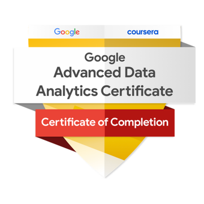

  

    <h1 class="about-name">Kha (Kai) Tran</h1>
    
Software Engineer &amp; Google Professional Cloud Architect

    

      Open to Work
      New grad &middot; Backend · Data · AI roles &middot; OPT authorized &middot; Open to relocation
    

    

      <a href="mailto:khatranminh98us@gmail.com">khatranminh98us@gmail.com</a>
      &ensp;&middot;&ensp;
      <a href="https://github.com/gamer2810" target="_blank" rel="noopener">GitHub</a>
      &ensp;&middot;&ensp;
      <a href="https://www.linkedin.com/in/kha-3k-tran/" target="_blank" rel="noopener">LinkedIn</a>
      &ensp;&middot;&ensp;
      <a href="https://www.credly.com/users/mkt" target="_blank" rel="noopener">Credly</a>
    

  

  

    <section class="about-section">
      <h2 class="about-section-title">Experience</h2>
      

        

          

            NAVER Corporation
            2023
          

          
Software Engineer Intern

          
Built a fan engagement platform serving <strong>100K+ MAU and 50K DAU</strong>. Designed scalable backend services to handle real-time interactions at consumer scale.

        

        

          

            MoMo (M_Service)
            2022 – 2023
          

          
Software Engineer

          
Optimized payments microservices for Vietnam's largest e-wallet, reducing end-to-end latency from <strong>1.2s to 100ms</strong> for millions of users.

        

        

          

            Western Illinois University
            Fall 2025 – Spring 2026
          

          
Teaching Assistant &amp; Teaching Support Assistant

          
Designed and taught CS101 curriculum for interdisciplinary students (music, LEJA, emergency management). Tutored graduate students in Computer Graphics and Computer Architecture alongside undergrad programming courses.

        

      

    </section>

    <section class="about-section">
      <h2 class="about-section-title">Education</h2>
      

        

          

            Western Illinois University
            May 2026
          

          
M.S. Computer Science &mdash; <strong>4.0 GPA</strong>

          
Capstone: EduKai &mdash; AI tutoring platform (LangGraph multi-agent · RAG pipeline · FSRS scheduling)

        

        

          

            VNUHCM - University of Science
            2020
          

          
B.S. Computer Science &mdash; 

        

      

    </section>

    <section class="about-section">
      <h2 class="about-section-title">Certifications</h2>
      

        <a class="about-cert-item" href="https://www.credly.com/users/mkt" target="_blank" rel="noopener">
          
          

            
Professional Cloud Architect

            
Google Cloud · Jun 2026

          

        </a>
        <a class="about-cert-item" href="https://www.credly.com/badges/4191393f-8d3c-45ec-8a2e-1713e2dad160" target="_blank" rel="noopener">
          
          

            
Advanced Data Analytics

            
Google / Coursera · Apr 2026

          

        </a>
      

    </section>

    <section class="about-section">
      <h2 class="about-section-title">Stack</h2>
      

        

          Languages
          

            Java
            Kotlin
            Go
            Python
          

        

        

          Backend
          

            Spring Boot
            gRPC
            Kafka
            Redis
          

        

        

          Cloud &amp; Infra
          

            GCP
            Kubernetes
            Docker
            Terraform
          

        

        

          AI / ML
          

            LangGraph
            RAG
            Vertex AI
          

        

      

    </section>

    <section class="about-section">
      <h2 class="about-section-title">Resume</h2>
      <a href="../assets/resume/MinhKhaTran_resume_SWE.pdf" download="mktran_resume.pdf" class="about-resume-btn">
        <i class="fas fa-download me-2"></i>Download PDF
      </a>
      

        <embed
          frameborder="0"
          scrolling="auto"
          type="application/pdf"
          src="../assets/resume/MinhKhaTran_resume_SWE.pdf"
          alt="Resume PDF"
        />
      

    </section>

  

